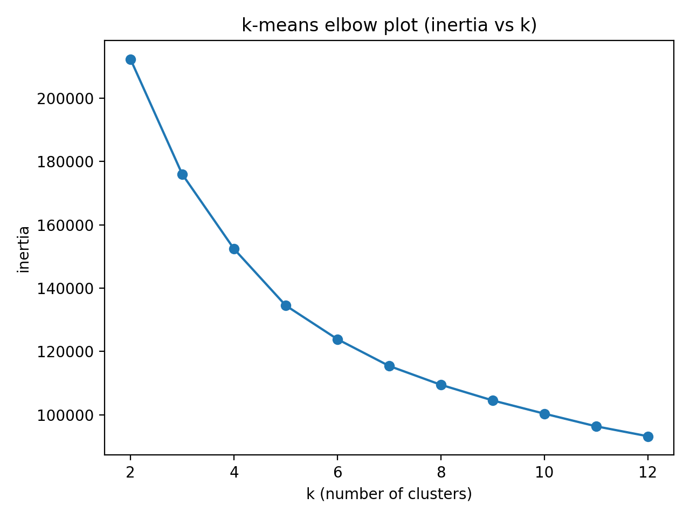

# Evaluation and Interpretation

## Building the Clusters

The aim of my adventurer profiler was to capture user engagement behavior and be able to categorize adventurers into one of a few engagement styles. In order to build adventurer personas in an unsupervised manner, I used k-means clustering via the scikit-learn implementation. I developed an adventurer feature table with one row per adventurer and filled it with view count, seconds watched, watch completion, days since active, publisher count, playlist count, app opens, and subscription cancellations. I used StandardScaler where appropriate and for all heavy-tailed counts log1p to compress extreme values and reduce dominance of outliers. Via an elbow plotting of different `K` values for the algorithm, I arrived at `K` = 5 as the optimal hyperparameter value. The elbow curve was relatively smooth, but the reduction in inertia was clear enough to indicate a K value of 5.

The resulting clusters had a silhouette score of 0.2180, which is modest but indictive that the clusters did in fact seperate data points into distinctive categories. The silhouette score takes into account both cohesion and seperation, and though not the strongest score, we do see non-trivial separation and it supports that the clustering is not just random noise. In addition to this metric, the interpretability and statistical-driven narrative behind the clustered adventurers passes a sanity check. They formed distinct profiles around engagement volume and follow-through, as well as subscription patterns, and I was able to identify representative adventurers per cluster (those closest to their respective centroids) whom matched each cluster’s profile. A visualization of the principal component analysis shows a rather distinct clustering around the first two components as well.

## The Adventurer Personas

Our algorithm, of course, produced five clusterings of the adventurers. With our clustering features revolving around engagement, we derived personas which grouped together viewers who shared similar behavior on the platform. The representative statistics shown below are the median values for their respective populations.

1. The Mainstream Average Joe/Josephina (33.6% of users)

   This persona shaped up to be the modest viewer. They are active and engage with content, but in a less heavy way than than their power using brethren. Their median age was considerablly higher, correlating with the typical inverse relation often seen between age and engagement. These are your moderate users, who are fully participating members on the platform but have balanced behavior.
   
   - Total seconds viewed 400
   - Total views 7
   - Completion rate 20%
   - Days since last view 26
   - Total subscriptions 4
   - App opens 44
   - Age 47

2. The Committed Power Explorer (34.3% of users)

   These were users who had broad exploration across both publishers and playlists, while still having the highest overall engagement. Their subscription commitment was strong, having the highest subscription counts and lowest cancellation rates. Tied for youngest of the clusters, with only a modest watch completion rate, these personas portray the youthful, stream-forward population who is constantly on their magical devices at the supper table.
   
   - Total seconds viewed 1,433
   - Total views 14
   - Completion rate 33%
   - Days since last view 9
   - Total subscriptions 6
   - App opens 60
   - Age 33

3. The Focused Fan (17.2% of users)

   This is the counterpart group to the Committed Power Explorer. These users know what they like and they stick with it. Their defining feature is that they subscribe to one and only one publisher, and they are active with that publisher's content! Recent activity, moderate views, and average completion rate show a userbase who have a preference and indulge it. Interestingly they are tightly grouped around the Puddington/Jamshire/Greycliffs/Sugarbrook regions.
   
   - Total seconds viewed 625
   - Total views 8
   - Completion rate 26%
   - Days since last view 8
   - Total subscriptions 1
   - App opens 40
   - Age 33

4. The Uninterested (13.2% of users)

   This group has abismal engagement metrics and display as users who have dabbled with the platform but show little interest in its offerings or have not yet had the opportunity to properly explore it. Their interaction is not non-existant, however. With appreciable app opens and views, they have tried the platform out, and so this points more likely towards users who have low interest. Their age is, unsuprisingly, the highest of all the groups (is that ageist?) and again correlates with the commonly seen trend of older users having lower engagement. They represent a tenth of the platform base and read as at high-risk of churning.
   
   - Total seconds viewed 29
   - Total views 2
   - Completion rate 0.04%
   - Days since last view 46
   - Total subscriptions 2
   - App opens 25
   - Age 64

5. The I-Forgot-To-Cancel-My-Subscription Crowd (1.7% of users)

   This cluster stood out as an anomly grouping. With absolutely zero viewing behavior, but existant subscriptions and app openings, the group seems to be most likely a clustering of outlier data points mixed with legitimate users who minimally explored the platform but never interacted.
   
   - Total seconds viewed 0
   - Total views 0
   - Completion rate 0.00%
   - Days since last view 0
   - Total subscriptions 2
   - Days since last subscribed 49
   - App opens 13
   - Age 85.5

  <em>Here the personas map as follows: 
     Mainstream (cluster 0), I-Forgot-To-Cancel-My-Subscription Crowd (cluster 1), 
     Power Explorer (cluster 2), Focused Fan (cluster 3), Uninterested (cluster 4).</em>

## Application of Personas

In the visual above, you can see a charting of users' average completion rates for individual items of content versus their overall engagement on the app (measured as length of time spent viewing). When the data points are color coded for the cluster they were assigned to, they show a clear stratification by cluster, with a sort of "decision boundary" between them as it relates to these features. This use of clustering to identify behavioral patterns and define user types can be leveraged by recommendation systems. The persona type a user appears to be can help inform the recommendations made for them. For instance, if a user shows to be a heavy explorer, the system can put added weight on diversifying the content suggested to them. You could also implement personas by treating them as actual features which go into the recommender. Apart from recommendation, this type of clustering might also prove useful in churn detection, as you could identify a persona type which may be susceptible to churning. Here, in our own clustering, we identified one such possible type in the form of the I-Forgot-To-Cancel-My-Subscription persona, who appear to be strong candidates for churning. That is, if they ever do in fact remember that they have active subscriptions.
